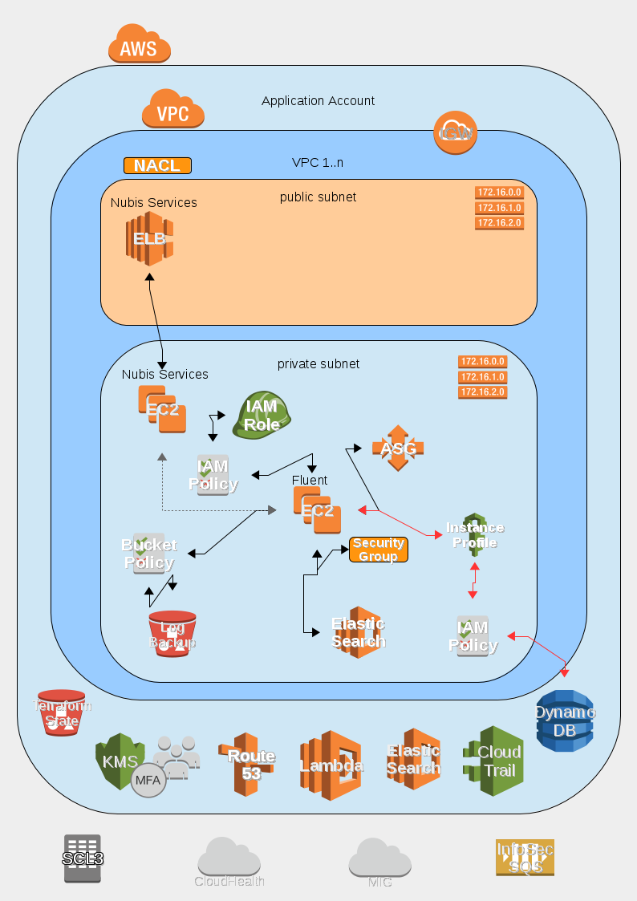

# Nubis Fluent Collector

## Fluent Deployment

The Fluent collector project is designed to be deployed into a standard Nubis
Account. It takes advantage of the standard deployment found [here](https://github.com/nubisproject/nubis-docs/blob/master/DEPLOYMENT_OVERVIEW.md).
For further specifics about Fluent consult the documentation [here](http://docs.fluentd.org/articles/quickstart).

The Fluent collectors collect logs and sort then into correct time order. The
logs are then sent to a S3 storege bucket as well as to an external SQS queue in
an account operated by InfoSec. Additionally the logs will be sent to an
Elastic Search cluster if it is enabled. The fluent collector is durable by way
of an Auto Scaling group, however it is not Highly Available (HA) as only a
single instance is deployed per VPC. The clients, installed on all of the
nodes, will cache logs in the event that the collector is unavailable. This
ensures that no logs are lost during upgrades of the collectors or in the event
of an Auto Scaling event.

**NOTE:** If the Fluent collectors are not deployed into an account there is a
risk of EC2 instances filling their disks as they cache logs.

### Deployment Diagram

**NOTE**: The line colors are representative and are for readability only. They
are not intended to indicate any underlying protocol or specific communication
details.

### Deployment Notes

The Nubis Fluent deployment consists of:

- A single EC2 instance acting as a Fluent collector
- An Auto Scaling group to provide resiliency
- A S3 log bucket where logs are stored
- An optional Elastic Search cluster where logs are stored

### Deployment Resources

Details for the deployment including; naming conventions, relationships,
permissions, etcetera, can be found in the [Terraform template](nubis/terraform/multi/main.tf)
used for deployment. Links to specific resources can be found in the following
table.

|Resource Type|Resource Title|Code Location|
|-------------|--------------|-------------|
|atlas_artifact|nubis-fluent-collector|[nubis/terraform/multi/main.tf#L6](nubis/terraform/multi/main.tf#L6)|
|aws_s3_bucket|fluent|[nubis/terraform/multi/main.tf#L35](nubis/terraform/multi/main.tf#L35)|
|aws_s3_bucket|elb|[nubis/terraform/multi/main.tf#L72](nubis/terraform/multi/main.tf#L72)|
|aws_security_group|fluent-collector|[nubis/terraform/multi/main.tf#L113](nubis/terraform/multi/main.tf#L113)|
|aws_iam_instance_profile|fluent-collector|[nubis/terraform/multi/main.tf#L187](nubis/terraform/multi/main.tf#L187)|
|aws_iam_role|fluent-collector|[nubis/terraform/multi/main.tf#L201](nubis/terraform/multi/main.tf#L201)|
|aws_iam_role_policy|fluent-collector|[nubis/terraform/multi/main.tf#L228](nubis/terraform/multi/main.tf#L228)|
|aws_launch_configuration|fluent-collector|[nubis/terraform/multi/main.tf#L282](nubis/terraform/multi/main.tf#L282)|
|aws_autoscaling_group|fluent-collector|[nubis/terraform/multi/main.tf#L330](nubis/terraform/multi/main.tf#L330)|
|aws_elasticsearch_domain|fluentd|[nubis/terraform/multi/main.tf#L368](nubis/terraform/multi/main.tf#L368)|
|null_resource|secrets|[nubis/terraform/multi/main.tf#L424](nubis/terraform/multi/main.tf#L424)|
